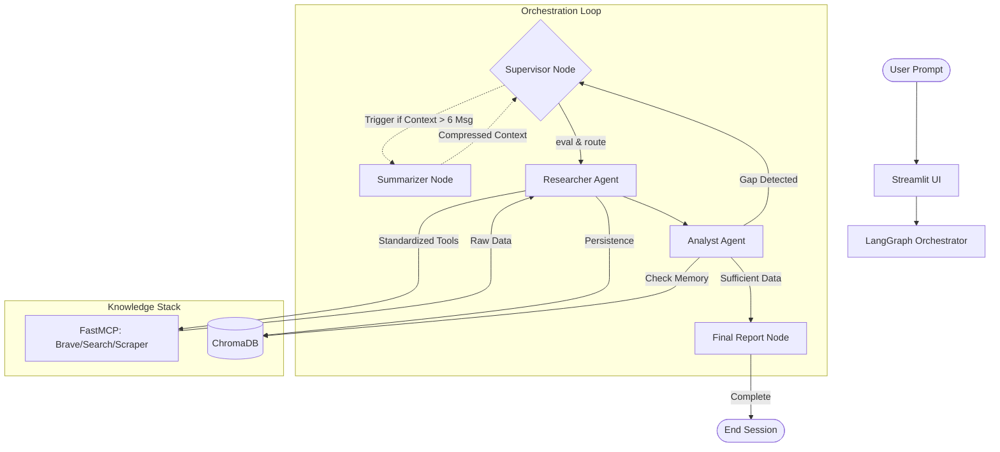

# 🤖 Agentic AI Workflow Orchestrator
### Production-Grade Multi-Agent RAG with LangGraph, MCP, & ChromaDB

[](https://www.python.org/downloads/)
[](https://github.com/langchain-ai/langgraph)
[](https://modelcontextprotocol.io/)
[](https://www.trychroma.com/)
[](https://streamlit.io/)

A stateful, multi-agent research system designed to automate complex information gathering and synthesis with **hallucination resistance** and **factual grounding**. This orchestrator employs cyclic reasoning to research, analyze, and verify data, producing high-precision reports backed by a local **ChromaDB** vector store.

---

## ✨ High-Level Value Proposition

### 🛡️ Factual Grounding & Hallucination Resistance
Unlike standard LLM chats, this orchestrator never "guesses." If the **Analyst** identifies a gap in the gathered data, it forces the **Researcher** back into the field. All synthesis is cross-referenced against raw tool outputs and vector DB sources.

### 🔌 Standardized Tooling via MCP
Leveraging the **Model Context Protocol (MCP)**, the system interacts with external tools (Search, Scrapers, Filesystems) through a standardized interface, ensuring decoupled, scalable, and reliable tool execution.

---

## 🏗️ System Architecture

The orchestrator utilizes a **Supervisor-Worker** pattern with integrated context compression and recursive guardrails.



---

## 🧠 Technical Deep Dive

### 🧼 State Hygiene
To prevent "topic bleed" and stale reasoning, the system implements strict state cleanup at the start of every user turn:
- **`messages` Reset**: The message history is cleared for the active turn, keeping only the new query.
- **`research_results` Flush**: Per-turn research artifacts are cleared to ensure the final report reflects the current query's findings.
- **`loop_count` Reset**: Tracking resets to zero to allow a full reasoning cycle for new tasks.

### 🛡️ Recursive Guardrails
Agentic loops can become expensive or infinite. We implement two layers of protection:
1. **Application Layer (`loop_count`)**: The `Supervisor` and `Analyst` track iterations; if research exceeds 15 steps, the system forces a "Best Effort" synthesis to the `Final Report` node.
2. **Infrastructure Layer (`recursion_limit`)**: LangGraph is configured with a hard `recursion_limit=25`. If the graph exceeds this threshold, execution halts to prevent API rate-limit exhaustion.

### 📉 Context Compression
The **Summarizer Node** monitors token pressure. When the message history exceeds 6 entries, it condenses the historical metadata into a `summary` field.
- **Active HumanMessage Preservation**: The summarizer is specifically tuned to purge system metadata while preserving the *last user message*, ensuring the Supervisor never loses sight of the current objective.

---

## 🛠️ The Knowledge Stack

- **Orchestration**: [LangGraph](https://github.com/langchain-ai/langgraph) (Stateful, cyclic graph execution).
- **Intelligence**: Anthropic Claude 3.5 Sonnet / Gemini 1.5 Pro.
- **Memory**: [ChromaDB](https://www.trychroma.com/) (Vector store for source-grounded retrieval).
- **Protocol**: [FastMCP](https://github.com/jlowin/fastmcp) (Standardized tool calling interface).

---

## 📂 Project Structure

```text
agentic-orchestrator/
├── src/
│   ├── agents/           # Supervisor, Researcher, Analyst
│   ├── graph/            # LangGraph workflow + nodes (summarizer, final_report)
│   ├── tools/            # MCP tool loading, ChromaDB memory, registries
│   ├── mcp_logic/        # MCP client utilities
│   ├── gui.py            # Streamlit dashboard (recommended UI)
│   ├── main.py           # CLI entry point
│   ├── server.py         # FastMCP server exposing search/scraper/memory
│   └── state.py          # AgentState definition and pruning utilities
├── tests/                # Unit tests for agents, nodes, tools, workflow, config
├── docs/                 # Additional documentation / templates
├── requirements.txt      # Python dependencies
├── .env.example          # Sample environment configuration
└── .gitignore            # Git ignore rules (venv, data, cache, etc.)
```

---

## 🚀 Installation & Usage

### 1️⃣ Prerequisites
- Python 3.10+
- Anthropic or OpenAI API Key
- [Optional] LangSmith API Key for tracing

### 2️⃣ Setup
```bash
# Clone the repository
git clone <repo-url>
cd agentic-orchestrator

# Create and activate virtual environment
python -m venv .venv
source .venv/bin/activate

# Install dependencies
pip install -r requirements.txt
```

### 3️⃣ Configuration
Create a `.env` file in the root directory:
```env
ANTHROPIC_API_KEY=your_anthropic_key
GOOGLE_API_KEY=your_google_key           # optional
SQLITE_DB_PATH=./data/app.db             # optional for future features
LANGSMITH_API_KEY=your_langsmith_key     # optional tracing
LANGSMITH_PROJECT=agentic-orchestrator
LANGSMITH_TRACING=true
```

### 4️⃣ Run the MCP server

The Researcher and Analyst talk to tools via a local FastMCP server. Start it first:

```bash
python -m src.server
```

This process should stay running in its own terminal.

### 5️⃣ Execution

**Launch the Streamlit Dashboard (recommended):**

```bash
# From the project root, with your venv active
export PYTHONPATH=\"$PWD\"
python -m streamlit run src/gui.py
```

**Launch the CLI (optional):**

```bash
python -m src.main
```

In the Streamlit UI, use the **Settings** sidebar to choose the LLM model, max research loops, and temperature. The main panel shows:

- **Final Research Synthesis** with Executive Summary, Comparison Matrix, and Detailed Analysis.
- A **Research Results** section with per-source snippets.
- A **Sources** tab with clickable references discovered via ChromaDB.

The **Agent Thought Process** sidebar visualizes each loop through `supervisor → researcher → analyst → final_report`.

---

## 🧑‍💻 Development & Testing

From the project root, with your virtual environment active:

```bash
# Run the full test suite
pytest tests/ -v

# Lint the codebase
ruff check src tests
```

For end-to-end manual testing:

1. Start the MCP server: `python -m src.server`.  
2. In another terminal, run: `export PYTHONPATH=\"$PWD\" && python -m streamlit run src/gui.py`.  
3. Ask a question in the chat and verify that the Agent Thought Process shows loops and the Final Research Synthesis populates with a comparison matrix and sources.

---

## 📜 License & Contributions

This project is intended to be open-sourced on GitHub. Add an appropriate `LICENSE` file (for example, MIT or Apache-2.0) at the repository root and reference it here once chosen.

Contributions are welcome via pull requests. A minimal `CONTRIBUTING.md` can document:

- How to set up the environment.  
- How to run tests and linting.  
- Any project-specific code style or review expectations.

---
*Built with precision by Surya Yalavarthi.*