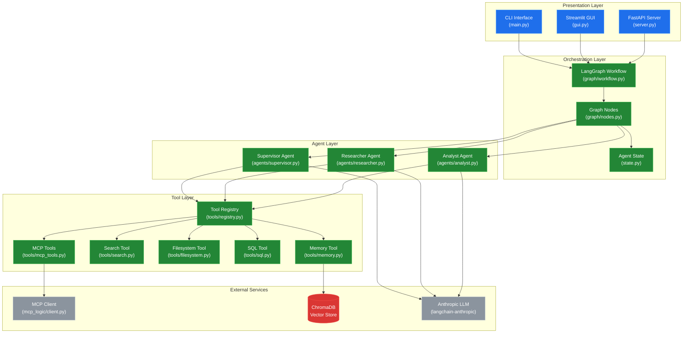
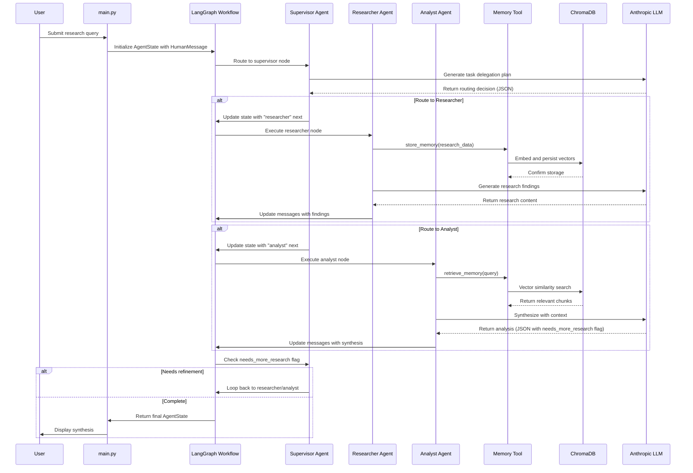

# System Blueprint: suryayalavarthi/Agentic-AI-Workflow-Orchestrator

> This orchestrator uses LangGraph and MCP for stateful, multi-agent research. A Supervisor routes tasks to Researchers and Analysts who store and retrieve data via ChromaDB RAG. It features cyclic refinement and context summarization to produce hallucination-resistant reports with full source traceability.
>
> Auto-generated on 2026-02-13 by Repo-to-Blueprint Architect

## Project Purpose
This is a multi-agent research orchestration system that uses LangGraph to coordinate Supervisor, Researcher, and Analyst agents. The system performs iterative research tasks with RAG-based memory (ChromaDB), produces synthesized reports with source traceability, and exposes both CLI and Streamlit interfaces.

## Technical Stack
- **Language**: Python 3.12
- **Framework**: LangGraph (stateful agent orchestration), LangChain (LLM abstractions), Streamlit (web UI)
- **Key Dependencies**:
  - Agent/LLM: `langgraph`, `langchain-core`, `langchain-anthropic`, `langchain-community`, `langchain-mcp-adapters`
  - MCP: `mcp`, `fastmcp`
  - RAG/Embeddings: `chromadb`, `sentence-transformers`
  - Tools: `duckduckgo-search`, `requests`, `beautifulsoup4`
  - Config: `python-dotenv`, `pydantic`, `pydantic-settings`
  - Testing: `pytest`, `pytest-asyncio`
- **Infrastructure**: GitHub Actions CI (`.github/workflows/ci.yml` — linting with Ruff, unit tests with pytest)

## Architecture Blueprint

## Request Flow

## Evidence-Based Risks

1. **Blocking I/O in async context** (`src/main.py:95-96`): `input()` call inside `async def run_cli()` blocks the event loop; should use `asyncio.to_thread(input, ...)` or aioconsole for non-blocking input.

2. **Missing API key validation** (`src/config.py` not shown, but `tests/test_server.py` and CI workflow use `ANTHROPIC_API_KEY: "test-key-ci"`): No evidence of startup validation for required API keys; runtime failures likely if keys missing.

3. **Unbounded recursion risk** (`src/main.py:86` sets `recursion_limit` from config, `src/graph/workflow.py` not shown): LangGraph cyclic refinement loop depends on `needs_more_research` flag in LLM JSON output; malformed LLM responses could cause infinite loops until recursion limit hit.

4. **ChromaDB persistence not configured** (`requirements.txt:19` includes `chromadb`, but no evidence of persistence path in `.env.example` or config): Default in-memory mode means all RAG data lost on restart; no durable storage configured.

5. **Test isolation issues** (`tests/conftest.py` not shown, but `pytest.ini` exists): 11 test files with shared state objects (AgentState, ChromaDB client) risk cross-test contamination without proper fixtures; `conftest.py` contents unknown.

---

## Repository Stats
| Metric | Value |
|--------|-------|
| Total Files | 44 |
| Total Directories | 9 |
| Generated | 2026-02-13 |
| Source | [suryayalavarthi/Agentic-AI-Workflow-Orchestrator](https://github.com/suryayalavarthi/Agentic-AI-Workflow-Orchestrator) |

---

*Generated by Repo-to-Blueprint Architect via n8n*
